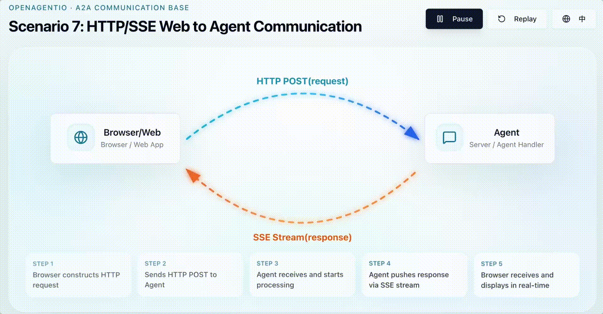
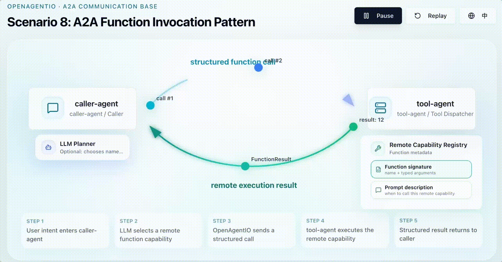

<div align="center">
<p align="center">


<h3 align="center">
OpenAgentIO
</h3>
<h5 align="center">
Conversation-Aware Runtime Bus for Distributed AI Agents
</h5>

<div align="center">Build conversational distributed systems with streaming, events, sessions, and traces. </div></div>

---

OpenAgentIO is a lightweight, bridgeable runtime bus and bridge layer for heterogeneous agent systems.

It maps third-party protocols, tools, and message networks (such as MCP servers, Matrix rooms, and HTTP/SSE streaming endpoints) into one runtime bus model. By translating external protocols into structured `Invoke`, `StreamInvoke`, and `Publish/Subscribe` flows, OpenAgentIO provides cross-process, cross-language agent collaboration with session propagation and OpenTelemetry tracing context.

> [!NOTE]
> **Developer Preview:** OpenAgentIO is under active development. The bridge layer and multi-language SDKs are currently available as an early developer preview (v0.3-alpha).

---

## What is OpenAgentIO?

 

Modern AI systems are no longer single agents running inside one process. They are distributed, multi-agent networks containing heterogeneous workers, tools, and platforms.

Yet, most agent frameworks focus on prompting, single-runtime orchestration, or local tool execution. OpenAgentIO serves as a **runtime integration layer** underneath, normalizing how these components talk, stream, trace, and maintain sessions.

### A Bridgeable Integration Layer

OpenAgentIO does not define how your agents talk to the world; it defines how they collaborate internally. It does not replace existing agent standards, but bridges them:

*   **MCP (Model Context Protocol)**: MCP defines how applications expose tools and context to LLMs and agents. OpenAgentIO bridges MCP servers, exposing their tools as native Bus `Invoke` targets.
*   **Matrix Event Network**: Matrix handles decentralized chats and message federation. OpenAgentIO bridges Matrix room messages into pub/sub Bus events, and routes agent outputs back.
*   **HTTP/SSE Gateways**: OpenAgentIO bridges OpenAI-compatible streaming endpoints (like OpenClaw) into unified `StreamInvoke` lifecycles.

```text
       External Protocols / Platforms (MCP, Matrix, SSE Gateways)
                                    │
                                    ▼  (Bridges)
                         [ OpenAgentIO Bridge Layer ]
                                    │
                                    ▼  (Normalize)
                      [ OpenAgentIO Runtime Bus (Go/Python) ]
         (Invoke / StreamInvoke / Publish / Subscribe / Session / Trace)
                                    │
                                    ▼
       Your Router Agents, Worker Agents, Task Processors, Background Jobs
```

## OpenAgentIO is NOT another Agent Framework

OpenAgentIO solves the communication and observability substrate of the AI runtime stack, rather than agent logic itself.

| Agent Frameworks (e.g. LangGraph, CrewAI) | OpenAgentIO (Bridgeable Runtime Bus) |
| ----------------------------------------- | ------------------------------------- |
| Workflow orchestration & DAGs             | Runtime communication substrate      |
| Prompt engineering & Agent logic          | Runtime interoperability              |
| Single-process workflow state             | Distributed messaging & routing       |
| In-process task pipelines                 | Cross-runtime collaboration           |
| Tool execution runtimes                   | Event-driven & streaming bridge layer |


## Why Conversational Distributed Systems?

Message brokers move bytes between services. Agent systems need more than that.

In a conversational distributed system:
- a conversation may span multiple agents, services, tools, and runtimes
- a single user turn may produce request/reply calls, streaming deltas, pub/sub events, and async task updates
- nested agent calls need to preserve conversational, causal, and observability context
- streaming responses need a clear lifecycle: started, delta, final, or error
- transports should be replaceable without rewriting agent communication semantics

OpenAgentIO provides this layer as a small runtime bus: one message model, one bus API, and transport adapters underneath.

## Problem Solved

Distributed Agent Communication Complexity

| Category | OpenAgentIO |
|---|---|
| Positioning | Conversation-Aware Agent Runtime Bus |
| Focus | Distributed Agent Runtime Communication |
| Protocols | invoke / stream / pubsub |
| Solves | Conversational Runtime Coordination |
| Architecture Layer | East-West Communication |
| Core Capabilities | Context / Session / Streaming |
| Message Model | Unified Runtime Messaging |
| Context Propagation | Conversation / Session / Trace Propagation |
| Runtime Support | Cross-Runtime Communication |
| Typical Scenarios | Multi-Agent Runtime |


## Communication Scenarios Coverage

| Scenario | Communication Pattern |
| --- | --- |
| ⭐️ Request-Reply | Synchronous Invocation |
| ⭐️ Streaming | Streaming Response |
| ⭐️ Pub/Sub | Event-Driven Messaging |
| ⭐️ Parallel Execution | Parallel Invocation |
| ⭐️ Agent Handoff | Context Transfer |
| ⭐️ Async Task | Asynchronous Task Processing |
| ⭐️ Browser/WebAPP Integration | HTTP + SSE Streaming |
| ⭐️ Remote Capability Calling | Agent-to-Agent Function Invocation |


## Scenario Demo

[]()
[]()
[]()
[]()
[]()
[]()
[]()
[]()

## Installation and More Examples

For details, please refer to [OpenAgentIO SDK Examples](https://github.com/ModulationAI/OpenAgentIO-example)

## Design Philosophy
OpenAgentIO focuses on the communication runtime layer for distributed AI agents.

Rather than building another agent framework, OpenAgentIO focuses on:
- invoke and request-reply semantics
- streaming agent communication
- async task signaling
- pub/sub patterns
- context propagation
- runtime interoperability
- transport-neutral messaging

The goal is to provide a small, explicit, and composable communication substrate for heterogeneous agent systems.

## Relationship to A2A

OpenAgentIO is not an alternative to A2A. A2A is an emerging interoperability protocol for agents; OpenAgentIO focuses on the runtime substrate that carries agent communication patterns inside distributed systems.
As the A2A ecosystem evolves, OpenAgentIO intends to absorb compatible ideas around:
   - task lifecycle semantics
   - streaming event models
   - interoperability patterns

while keeping the runtime model composable across different transport backends.

## Roadmap

> [!WARNING]
> OpenAgentIO is under active development and currently in the 0.3-alpha developer preview stage.
>
> The project is being rapidly refined around runtime communication APIs, bridge integrations, protocol design, and cross-runtime interoperability.
>
> The bridge layer is usable for experimentation and integration demos, but should not yet be treated as a production-ready service mesh or full protocol runtime.

- v0.1: Go runtime, envelope schema, in-memory transport, NATS Core transport, invoke and streaming APIs.
- v0.2.x: HTTP/SSE adapter, Python SDK, session/trace propagation, OpenTelemetry bridge, retry / dead-letter middleware.
- v0.3.x: Developer-preview bridge layer for MCP tools, Matrix events, and HTTP/SSE streaming gateways.
- v0.4.x: Advanced orchestration scenes, control plane foundation.
- v1.0.x: stable runtime message schema, cross-language compatibility, and production deployment guidance.

## License

OpenAgentIO is licensed under the Apache License 2.0. See [LICENSE](LICENSE) for details.
